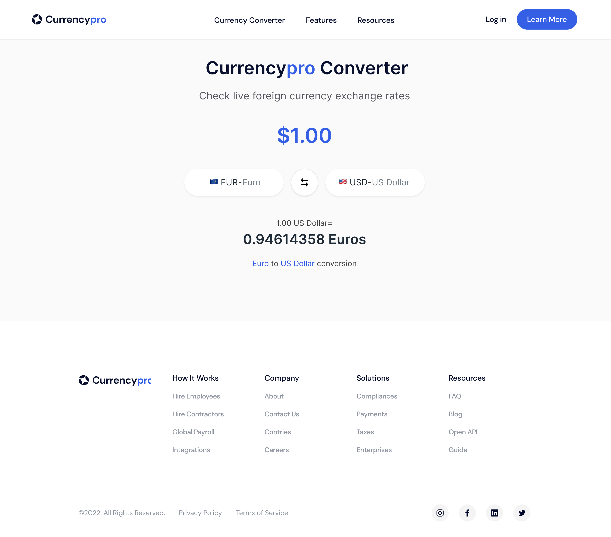

# Learn JavaScript with Jad Joubran Workshop 2024 

## Create a Currency Converter using the Exchange-Rate API in JavaScript

## Prerequisites

  - Study the [Figma Designs](https://www.figma.com/file/0fqg6mYPiyI7JVmKgbhADd/CurrencyPRO---Learn-JavaScript-Projects?type=design&node-id=0%3A1&t=OpefauhDrzUN5gZ0-1) and try to recreate them from scratch using HTML. In case you want to focus just on the JavaScript part, we have already included two HTML pages that can be used as a boilerplate. Check the `/html/` folder.

## Assets

  Here is what you will find in this repository:

  - `/assets/figma/`
    - Figma design for Beginner level: `Figma.Beginner.png`
    - Figma design for Advanced level: `Figma.Advanced.png`